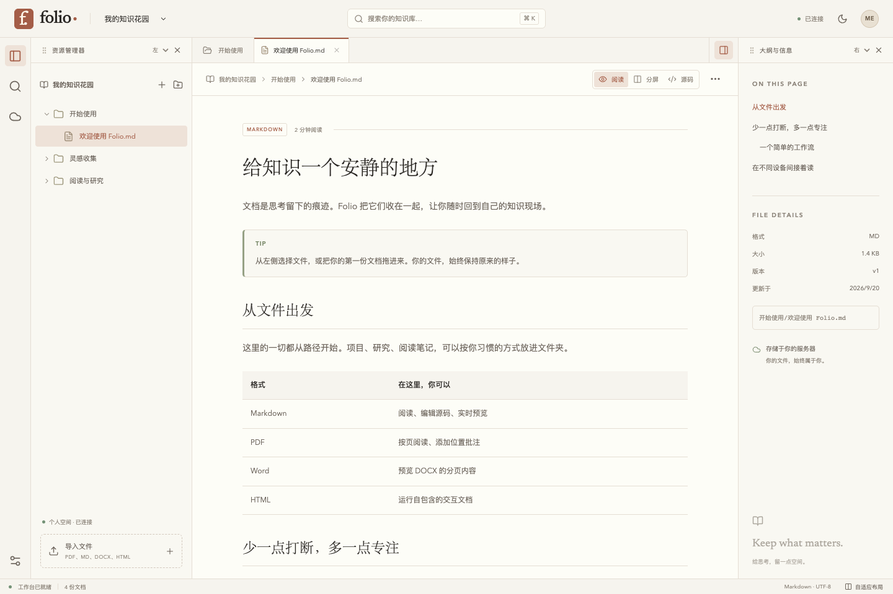

# Folio

自部署的个人文档工作台。用路径管理多知识库，预览 PDF / Markdown / DOCX / 自包含 HTML；Markdown 直接编辑源码，PDF 添加位置批注。



## 已实现

- **文件管理**：多知识库、新建目录、新建 Markdown、批量上传、拖放上传、通过导入更新、移动/重命名、递归删除、路径搜索、原文件下载、整库 ZIP 导出（含批注 JSON）。
- **三端 Workbench**：桌面活动栏、文件标签、可隐藏/拖拽停靠/缩放的资源与检查面板；平板侧栏 + 抽屉；手机底部导航 + 菜单。布局和深浅主题在本机持久保存。
- **阅读**：沿用 EA.KB.IO 的纸色、棕色强调、衬线标题及 marked 渲染管线。Shiki 高亮、KaTeX、Mermaid、表格、任务列表、GitHub Alerts、callout；Markdown 源码/阅读/分屏切换。
- **PDF**：PDF.js、按页渲染、缩放、HTTP Range 优先、页内位置批注。新文件版本上的批注单独标记，重命名保留定位。
- **DOCX / HTML**：DOCX 浏览器排版；HTML 支持内联 CSS/JS。预览用独立来源的 sandbox iframe，不能读取主站 DOM、cookie 或调用 API。
- **离线**：应用外壳约 0.86 MiB 预缓存；阅读器和原文件渐进缓存；整库缓存入口；200 MiB 文档缓存上限；IndexedDB 本地草稿、手动同步、冲突保留、草稿导出。
- **后端**：Rust / Axum / Tokio、SQLite WAL、连接池、不可变 blob、流式上传、范围下载、版本 + 文件身份校验、单用户密码和 HttpOnly 会话。

## 本地运行

需要 Node.js 22.13+、npm、Rust 1.98.1（本次验证版本）。所有命令在本目录运行。

```bash
npm --prefix frontend ci
npm --prefix frontend run build
export FOLIO_PASSWORD='choose-a-long-local-password'
export FOLIO_DATA="$PWD/data"
export FOLIO_WEB="$PWD/frontend/dist"
cargo run --manifest-path backend/Cargo.toml
```

打开 <http://127.0.0.1:8787>，使用设置的密码登录。空库可点击「探索示例」创建示例内容，也可直接创建自己的知识库。生产构建在本地提供完整 Service Worker / PWA 能力。

开发时运行 `./scripts/dev.sh`，前端在 `http://127.0.0.1:5173`，API 代理到 8787。Vite 开发模式不注册 Service Worker，离线测试使用上面的生产构建。

### macOS 持续本地预览

临时终端会话结束后，前台预览进程可能停止。完成本地构建后，可使用 launchd 启动与终端独立的预览：

```bash
FOLIO_PASSWORD='your-local-password' ./scripts/preview-local.sh start
./scripts/preview-local.sh status
./scripts/preview-local.sh stop
```

该预览只监听 `127.0.0.1:8787`，日志在 `data/preview.log` 和 `data/preview-error.log`。它不是开机自启服务；注销/重启后需重新启动。密码使用启动时提供的值。

## Ubuntu 22.04 + Docker CE

仓库提供多阶段 Dockerfile、Compose、可选 Caddy HTTPS profile。**本次未执行部署；当前工作机没有 Docker 引擎，容器构建与 Ubuntu 实机检查尚未执行。** 原生 Rust 服务与生产前端已实际联调。

准备：

```bash
cp .env.example .env
# 编辑 .env，替换访问密码，长度至少 12 字符。
docker compose config
# 仅构建，不启动服务：
docker compose build
```

部署时运行（由使用者执行）：

```bash
docker compose up -d
```

默认仅绑定宿主机 `127.0.0.1:8787`。跨设备访问时使用 HTTPS 反向代理。若使用随附 Caddy，设置 `FOLIO_DOMAIN` 为已解析到虚拟机的域名、`FOLIO_SECURE_COOKIE=true`，再运行：

```bash
docker compose --profile https up -d
```

Caddy 使用 80/443 端口申请并维护证书。已有反向代理时可直接代理默认本机端口。PWA 安装与 Service Worker 需要 HTTPS（localhost 除外）；iOS Safari 可用「分享 → 添加到主屏幕」。

容器使用非 root 用户、只读根文件系统、独立数据卷、健康检查和 SIGTERM 优雅关闭。宿主机 Ubuntu 22.04；容器内部 Debian Bookworm，避免运行时 libc 不匹配。

## 配置

| 变量 | 默认值 / 用途 |
|---|---|
| `FOLIO_PASSWORD` | 必填，至少 12 字符；个人空间统一访问密码 |
| `FOLIO_BIND` | `127.0.0.1:8787`；容器内为 `0.0.0.0:8787` |
| `FOLIO_DATA` | `./data`；SQLite、blob、临时导出文件 |
| `FOLIO_WEB` | `../frontend/dist`；建议使用绝对路径 |
| `FOLIO_SECURE_COOKIE` | `false`；HTTPS 环境设置为 `true` |
| `RUST_LOG` | 如 `info` 或 `folio_kb=debug,tower_http=info` |

限制：单文件 64 MiB；MD/HTML 为 UTF-8，最大 8 MiB；接受小写扩展名 `.md .pdf .docx .html .htm`。Word 格式为 DOCX，不包含旧二进制 DOC。DOCX 复杂版式、特殊字体、字段和修订内容可能与 Word 不完全一致。

## 验证

```bash
cargo test --manifest-path backend/Cargo.toml
cargo clippy --manifest-path backend/Cargo.toml --all-targets -- -D warnings
npm --prefix frontend run build
npm --prefix frontend exec playwright install chromium
# 启动本地 8787 服务后：
FOLIO_TEST_PASSWORD='your-local-password' npm --prefix frontend test
```

E2E 会在指定服务中创建临时知识库并在测试后删除。只在测试环境运行。可用 `FOLIO_TEST_URL` 指向其他测试端口。测试截图保存在 `docs/screenshots/`。

更多说明：[架构与 ADR](docs/architecture.md) · [数据运维与恢复](docs/operations.md) · [API](docs/api.md) · [验证报告](docs/verification.md)

## 原型边界

这是面向个人、同一所有者跨设备使用的可运行原型。同步采用 15 秒目录/批注刷新、窗口聚焦刷新和乐观并发检查；Markdown 冲突保留本地内容并允许下载、载入远端，未实现多人 CRDT 同步编辑。离线可修改已读取的 Markdown；新建目录、导入、删除与批注写入需要联网。

缓存属于单个浏览器；文件总量超过 200 MiB 时较早内容会被淘汰。清理浏览器数据会丢失本地草稿，请用服务器备份和草稿导出保留重要内容。外链图片、外链字体或脚本不保证离线可用；自包含 HTML 的外部网络访问被预览 CSP 禁止。

## 来源与许可

视觉 tokens 和 Markdown 渲染实现参考并改编自 [yceachan/yceachan.github.io](https://github.com/yceachan/yceachan.github.io)，参考提交 `041c303cc4e068e59470d9c780f2820add6f4b7b`。原作者 MIT 许可保留在 [EA-KB-LICENSE.txt](docs/EA-KB-LICENSE.txt)。修改包括有限语言高亮、渐进缓存、独立 Workbench 和动态服务端内容。其他依赖遵循各自许可。
